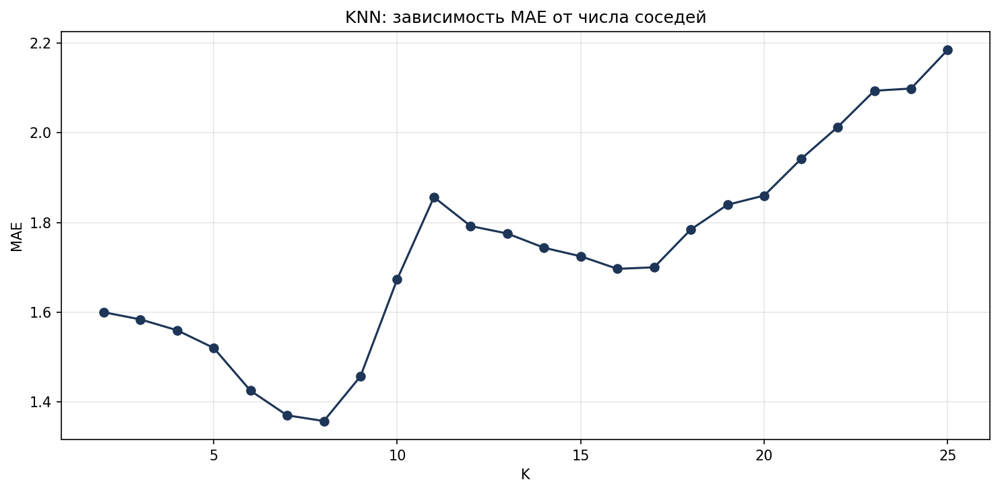
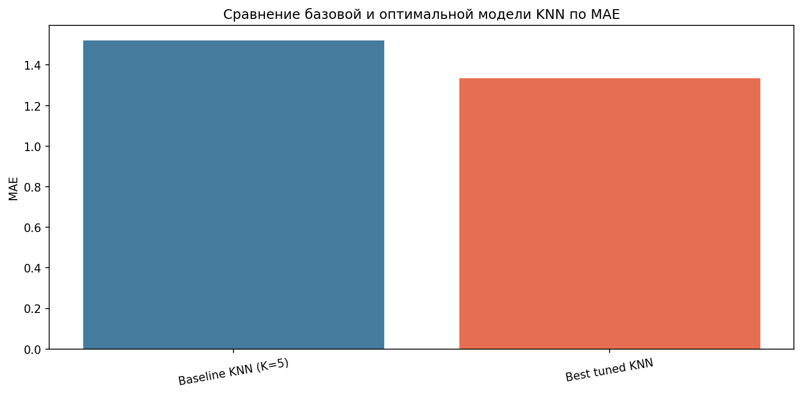

# Лабораторная работа №3

## Титульный лист

**Дисциплина:** Машинное обучение  
**Тема:** Подготовка обучающей и тестовой выборки, кросс-валидация и подбор гиперпараметров на примере метода ближайших соседей  
**Тип задачи:** регрессия  
**Датасет:** `ipc_dataset.csv`  
**Целевой признак:** `total`

## Описание задания

В лабораторной работе решается задача прогнозирования общего индекса потребительских цен `total` по временным признакам и лагам предыдущих значений.

Выполнены следующие шаги:

1. Выбран датасет `ipc_dataset.csv`.
2. Проведена подготовка данных:
   - строковые значения с запятой преобразованы в числа;
   - добавлены циклические признаки месяца `month_sin` и `month_cos`;
   - построены лаги `lag1`, `lag2`, `lag3` для признаков `total`, `food`, `non_food`, `services`;
   - строки с пропусками после формирования лагов удалены.
3. С помощью `train_test_split(..., shuffle=False)` выборка разделена на обучающую и тестовую.
4. Обучена базовая модель `KNeighborsRegressor` с произвольным гиперпараметром `K=5`.
5. Выполнен подбор гиперпараметров с использованием:
   - `GridSearchCV`;
   - `RandomizedSearchCV`;
   - двух стратегий кросс-валидации: `KFold` и `TimeSeriesSplit`.
6. Сравнены метрики качества исходной и оптимальной модели.

При выполнении работы ориентиром служили материалы по `k-NN`, метрикам и кросс-валидации из предоставленных источников.

## Текст программы

Основной запуск:

```powershell
py train.py
```

Основные файлы:

- `data/data_processing.py` — подготовка признаков и целевой переменной;
- `models/knn_model.py` — построение pipeline `StandardScaler + KNeighborsRegressor`;
- `train.py` — обучение baseline-модели, подбор гиперпараметров, расчёт метрик и сохранение графиков.

## Результаты

### Базовая модель

| Модель | MAE | RMSE | R2 |
|---|---:|---:|---:|
| Baseline KNN (K=5) | 1.520116 | 2.610202 | 0.192564 |

### Подбор гиперпараметров

| Поиск | CV | Лучшие параметры | CV MAE | Test MAE | Test RMSE | Test R2 |
|---|---|---|---:|---:|---:|---:|
| GridSearchCV | TimeSeriesSplit | `K=7`, `p=1`, `weights=uniform` | 6.118059 | 1.335295 | 2.195341 | 0.428832 |
| RandomizedSearchCV | TimeSeriesSplit | `K=10`, `p=1`, `weights=distance` | 6.188750 | 1.336500 | 2.087468 | 0.483584 |
| GridSearchCV | KFold | `K=2`, `p=1`, `weights=distance` | 45.802324 | 1.576077 | 2.667710 | 0.156593 |
| RandomizedSearchCV | KFold | `K=2`, `p=1`, `weights=uniform` | 46.011098 | 1.543533 | 2.578008 | 0.212359 |

### Сравнение исходной и оптимальной модели

| Модель | MAE | RMSE | R2 |
|---|---:|---:|---:|
| Baseline KNN (K=5) | 1.520116 | 2.610202 | 0.192564 |
| Best tuned KNN | 1.335295 | 2.195341 | 0.428832 |

Вывод по `lab3`: оптимизация гиперпараметров улучшила качество модели. Лучшей по значению `CV MAE` оказалась стратегия `GridSearchCV + TimeSeriesSplit`, что логично для временного ряда. На тестовой выборке значение `MAE` снизилось, а `R2` заметно вырос по сравнению с базовой моделью.

## Экранные формы с примерами выполнения программы

### 1. Зависимость MAE от числа соседей



### 2. Сравнение baseline и tuned KNN



### 3. Пример консольного запуска

```text
Размер обучающей выборки: (667, 16)
Размер тестовой выборки: (167, 16)

Базовая модель:
             Model      MAE     RMSE       R2
Baseline KNN (K=5) 1.520116 2.610202 0.192564

Лучшая стратегия:
{
  "Search": "GridSearchCV",
  "CV": "TimeSeriesSplit",
  "BestParams": {
    "knn__n_neighbors": 7,
    "knn__p": 1,
    "knn__weights": "uniform"
  },
  "CV_MAE": 6.1180592020592055
}
```

## Notebook

Для отчёта подготовлен notebook:

- `notebooks/lab3_analysis.ipynb`

Дополнительные артефакты:

- `notebooks/search_results_summary.csv`
- `notebooks/model_comparison.csv`
- `notebooks/mae_by_k.csv`
- `notebooks/best_search.json`

## Вывод

В работе показано, что для задачи прогнозирования индекса потребительских цен метод ближайших соседей чувствителен к выбору гиперпараметра `K` и стратегии кросс-валидации. Подбор гиперпараметров позволил получить более точную модель, а использование `TimeSeriesSplit` оказалось наиболее оправданным для последовательных данных.
