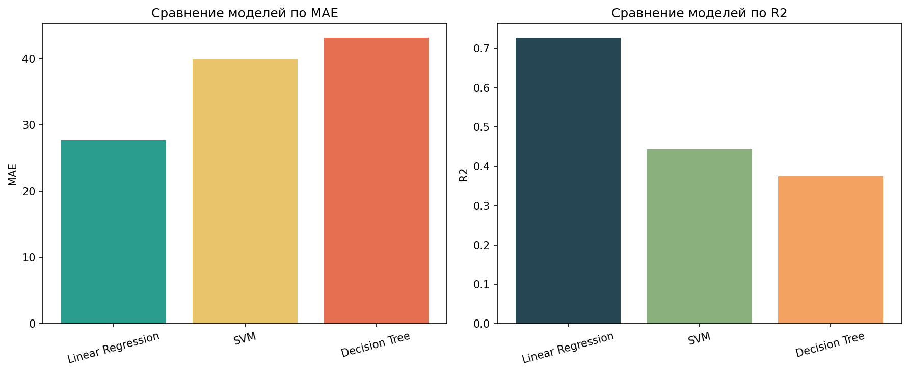
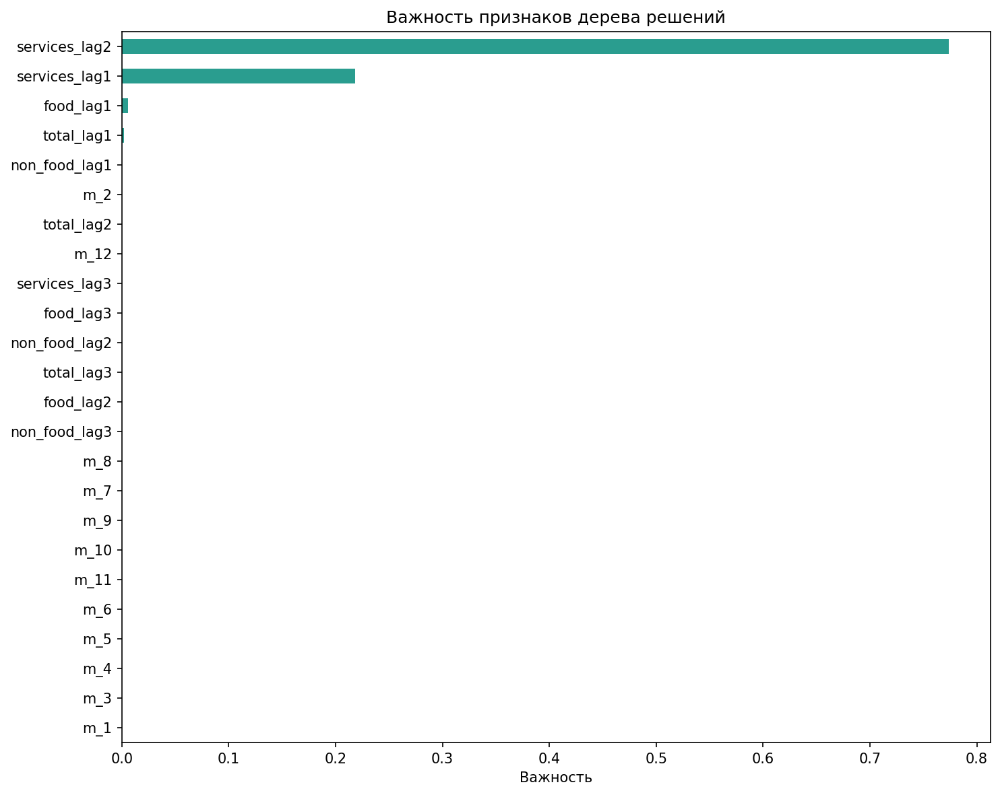
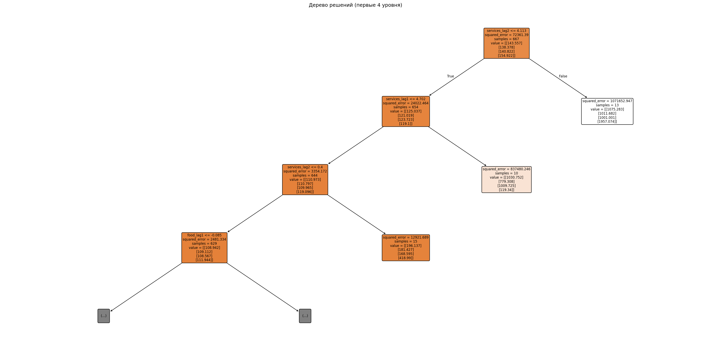

# Лабораторная работа 4

## Описание задания

Требуется выбрать датасет для задачи классификации или регрессии, выполнить предобработку данных, разделить выборку на обучающую и тестовую с помощью `train_test_split`, обучить несколько моделей и сравнить их качество по двум метрикам.

В данной работе выбрана задача **регрессии** на основе набора данных `ipc_dataset.csv`, содержащего индексы инфляции потребительских цен. Предсказываются сразу четыре целевых признака:

Датасет до обрботки взят с Росстата.
- `total`
- `food`
- `non_food`
- `services`

## Что сделано

В проекте реализованы:

- предобработка данных в `data/data_processing.py`;
- обучение трёх моделей:
  - линейная регрессия;
  - SVM;
  - дерево решений;
- сравнение моделей по метрикам `MAE` и `R2`;
- построение графика важности признаков для дерева решений;
- визуализация дерева решений;
- Jupyter Notebook с полным разбором решения.

## Предобработка данных

Перед обучением моделей выполняются следующие действия:

1. Названия месяцев переводятся в числовой формат.
2. Строковые значения с запятой преобразуются в вещественные числа.
3. Формируются лаговые признаки `lag1`, `lag2`, `lag3` для целевых столбцов.
4. Признак месяца кодируется методом one-hot encoding.
5. После создания лагов удаляются строки с пропусками.

## Текст программы

Основной запуск выполняется командой:

```powershell
py train.py
```

Скрипт загружает данные, делит выборку на обучающую и тестовую, масштабирует признаки, обучает модели и выводит итоговую таблицу с метриками.

Дополнительные материалы для отчёта:

```powershell
py notebooks\quality_of_models.py
py notebooks\decision_tree_graph.py
```

Эти скрипты сохраняют:

- `notebooks/model_comparison.png` - сравнение моделей;
- `notebooks/feature_importance.png` - важность признаков дерева решений;
- `notebooks/decision_tree.png` - визуализацию дерева решений;
- `notebooks/model_metrics.csv` - таблицу метрик.

## Результаты

Итоговые значения метрик:

| Модель | MAE | R2 |
|---|---:|---:|
| Linear Regression | 27.679629 | 0.726351 |
| SVM | 39.954708 | 0.442596 |
| Decision Tree | 43.150084 | 0.375073 |

Лучшая модель по обеим метрикам в рамках этого эксперимента - **Linear Regression**.

## Экранные формы с примерами выполнения программы

### 1. Сравнение качества моделей



### 2. График важности признаков дерева решений



### 3. Визуализация дерева решений



### 4. Пример консольного запуска

```text
Размер признаков: (834, 24)
Размер целевой переменной: (834, 4)

Сравнение моделей:
            Model       MAE       R2
Linear Regression 27.679629 0.726351
              SVM 39.954708 0.442596
    Decision Tree 43.150084 0.375073
```

## Jupyter Notebook

Полный разбор лабораторной работы находится в файле:

- `notebooks/lab4_analysis.ipynb`

## Вывод

Для выбранного набора данных задача была решена как задача многовыходной регрессии. Были обучены три модели, выполнено сравнение по метрикам `MAE` и `R2`, а также построены интерпретируемые визуализации для дерева решений. По итогам эксперимента лучшей моделью оказалась линейная регрессия.
