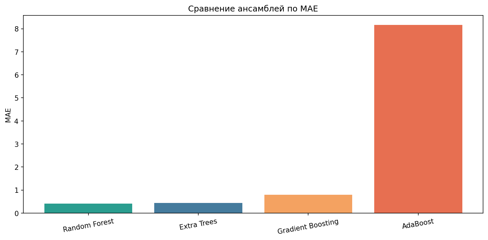
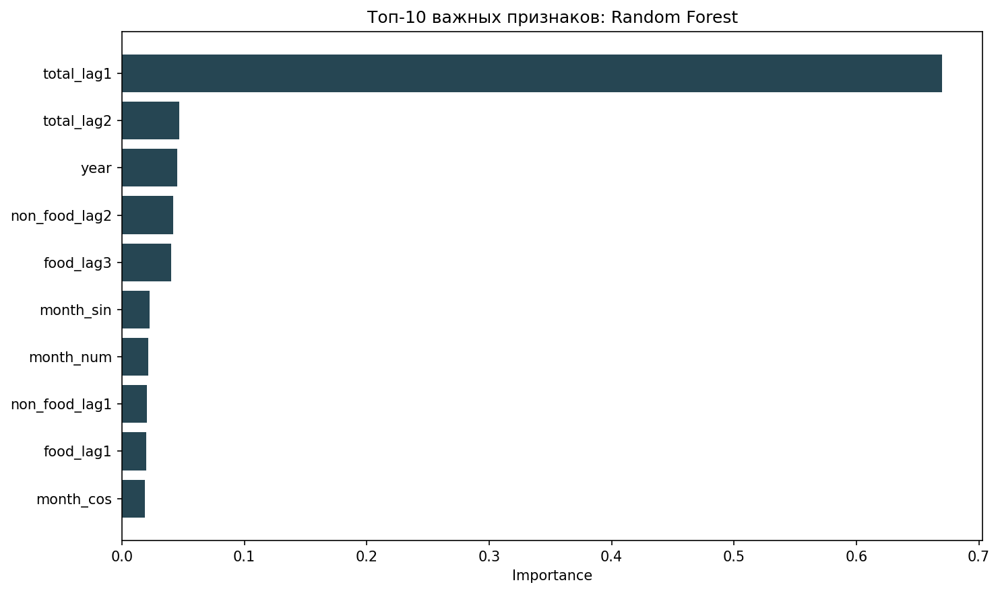

# Лабораторная работа №5

## Титульный лист

**Дисциплина:** Машинное обучение  
**Тема:** Ансамбли моделей машинного обучения. Часть 1  
**Тип задачи:** регрессия  
**Датасет:** `ipc_dataset.csv`  
**Целевой признак:** `total`

## Описание задания

В лабораторной работе исследуются ансамблевые модели для прогнозирования общего индекса потребительских цен `total`.

Выполнены следующие этапы:

1. Выбран датасет `ipc_dataset.csv`.
2. Подготовлены данные:
   - строковые значения переведены в числовой формат;
   - добавлены признаки месяца и его циклическое представление;
   - построены лаговые признаки для `total`, `food`, `non_food`, `services`;
   - строки с пропусками после построения лагов удалены.
3. С использованием `train_test_split(..., shuffle=False)` данные разделены на обучающую и тестовую выборки.
4. Обучены ансамблевые модели:
   - `RandomForestRegressor`;
   - `ExtraTreesRegressor`;
   - `AdaBoostRegressor`;
   - `GradientBoostingRegressor`.
5. Выполнено сравнение моделей по метрикам `MAE`, `RMSE`, `R2`.

В качестве теоретической базы использованы предоставленные материалы по ансамблям, деревьям решений и метрикам качества.

## Текст программы

Основной запуск:

```powershell
py train.py
```

Основные файлы:

- `data/data_processing.py` — подготовка данных;
- `models/ensemble_models.py` — конфигурации ансамблевых регрессоров;
- `train.py` — обучение моделей, расчёт метрик, построение графиков и сохранение таблиц.

## Результаты

| Модель | MAE | RMSE | R2 |
|---|---:|---:|---:|
| Random Forest | 0.407490 | 0.608892 | 0.956062 |
| Extra Trees | 0.438878 | 0.663324 | 0.947855 |
| Gradient Boosting | 0.800122 | 1.004355 | 0.880454 |
| AdaBoost | 8.170563 | 8.506413 | -7.575367 |

Лучшая модель по `MAE` и `R2` — **Random Forest**.  
`Extra Trees` также показала высокое качество, а `AdaBoost` заметно уступила остальным моделям на выбранных признаках.

### Топ-10 признаков лучшей модели

| Признак | Важность |
|---|---:|
| total_lag1 | 0.669703 |
| total_lag2 | 0.047055 |
| year | 0.045026 |
| non_food_lag2 | 0.041861 |
| food_lag3 | 0.040073 |
| month_sin | 0.022587 |
| month_num | 0.021321 |
| non_food_lag1 | 0.020413 |
| food_lag1 | 0.019976 |
| month_cos | 0.018734 |

## Экранные формы с примерами выполнения программы

### 1. Сравнение ансамблевых моделей



### 2. Важность признаков лучшей модели



### 3. Пример консольного запуска

```text
Размер обучающей выборки: (667, 16)
Размер тестовой выборки: (167, 16)

Сравнение ансамблевых моделей:
            Model      MAE     RMSE        R2
    Random Forest 0.407490 0.608892  0.956062
      Extra Trees 0.438878 0.663324  0.947855
Gradient Boosting 0.800122 1.004355  0.880454
         AdaBoost 8.170563 8.506413 -7.575367
```

## Notebook

Для отчёта подготовлен notebook:

- `notebooks/lab5_analysis.ipynb`

Дополнительные артефакты:

- `notebooks/ensemble_metrics.csv`
- `notebooks/feature_importance.csv`

## Вывод

Ансамблевые методы показали существенно более высокое качество по сравнению с одиночными моделями, которые использовались ранее. На выбранной задаче лучше всего проявили себя модели группы бэггинга, особенно `Random Forest`, что подтверждается минимальным `MAE`, низким `RMSE` и высоким `R2`.
